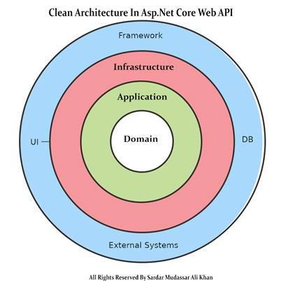

> về cơ bản, các mục tiêu cốt lõi của Clean Architecture cũng giống với đối với Ports & Adapters (Hexagonal) và Onion Architectures
> thực tế là nó không phải 1 mô hình đột phá mới mà nó khôi phục, làm rõ các khái niệm, quy tắc, khuôn mẫu quan trọng 

========================================================================

# Clean Architecture
* -> là 1 **development approach**
* -> _i **`loại bỏ sự lệ thuộc trực tiếp`** giữa các **object** cũng như các **layer** trong ứng dụng - **`hướng tâm`**: các layer ở trong không biết gì về các layer bên ngoài_

* về cơ bản thì gồm **4 layer** được đại diện thông qua các vòng tròn đồng tâm
* -> **Enitites** , **Use Cases** , **Interface Adapters** (**`Controllers, Gateways, Presenters`**), **Frameworks & Drivers** (**`UI, Web, DB, Framework, devices`**)
* -> để các layer trong Clean Architecture có thể làm việc được nhưng lại độc lập với nhau thì chúng sẽ dùng các **interfaces**
* -> mỗi vòng sẽ có tập hợp các "Dependencies", chỉ có **`objects của vòng ngoài mới phụ thuộc vào dependencies của vòng trong không có chiều ngược lại`**
<br/>

* => nó sẽ **đòi hỏi viết nhiều class, interface**; nhưng nhờ sự độc lập giữa các tầng mà việc **Debug và Testing trở nên dễ dàng** hơn
* _tách biệt `presentation logic`, `business logic`, `data access logic`_
* _vẫn test được dù thiếu `Database`, `Web server`_

## Note
* -> bởi việc đảm bảo business rules và core domain của ta bên trong vòng tròn là hoàn toàn **không có bất kì sự phụ thuộc nào bên ngoài hoặc các thư việc bên thứ 3 (3rd party libraries)**
* -> có nghĩa là chúng phải **`sử dụng code C# thuần`** vì sẽ dễ dàng hơn trong việc test

* -> khi chúng ta truyền dữ liệu qua một ranh giới (Boundary), nó **luôn ở dạng thuận tiện nhất cho vòng tròn phía trong**

* -> `Clean Architecture` là kiến trúc tham khảo, nên trên thực tế **không nhất thiết phải là 4 tầng**

```r - Ex: 
// 1 business của API update "product"
// gồm 3 tầng: "Transport" -> "Business" -> "Repository/Storage"
// chứa tương ứng: "HTTP Handler methods; parse & validate data from request" -> "implement business logic" -> "store, retrieve data"
// business: "API update Product" -> "UpdateProduct(product)" -> "FindProductById(id); UpdateProduct(product)"
```

========================================================================


# Layers

## Entities (`Enterprise Business Rules`)
* -> Entities là layer trong cùng, cũng là **`layer quan trọng nhất`**
* -> Entity chính là các thực thể hay từng **đối tượng cụ thể và các rule business logic của nó**
* -> trong OOP, đây chính là Object cùng với **`các method và properties tuân thủ nguyên tắc Encapsulation`** - chỉ bên trong Object mới có thể thay đổi trạng thái (State) của chính nó

```r 
// -> trong object Person thì thuộc tính age không thể bé hơn 1
// -> khi cần thay đổi age, ta cần phải thông qua hàm public setAge - hàm này cũng chịu trách nhiệm check điều kiện liên quan tới age

// -> các business logic của layer Entities sẽ không quan tâm hay lệ thuộc vào các business logic ở các layer bên ngoài như "Use Cases"
// -> giả sử với trường hợp người dùng phải từ 18 tuổi trở lên mới được phép tạo tài khoản thì rule thuộc tính Age trong Entities vẫn không đổi
```

## Use Cases (`Application Business Rules`)
* -> layer chứa các **business logic ở cấp độ cụ thể từng Use Case (hay application)**

```r - Ex:
// -> "Use Case" đăng ký tài khoản (tạo mới một Person/Account) sẽ cần tổ hợp một hoặc nhiều Entities tuỳ vào độ phức tạp của Use Case
// -> các business logic của Use Case sẽ không quan tâm và lệ thuộc vào việc dữ liệu đến từ đâu, dùng các thư viện nào làm apdapter, dữ liệu thể hiện thế nào,... vì đấy là nhiệm vụ của layer Interface Adapters
```

## Interface Adapters
* -> layer phụ trách việc **chuyển đổi các format dữ liệu để phù hợp với từng Use Case và Entities**, các format dữ liệu này có thể dùng cho cả bên trong hoặc ngoài ứng dụng

```r - Ex:
// -> thông tin người dùng sẽ có một số thông tin rất nhạy cảm như Email, Phone, Address
// -> không phải lúc nào dữ liệu cũng về đầy đủ để phục vụ GUI (Web, App); tương tự với tuỳ vào hệ thống Database mà các adapter phải format dữ liệu hợp lý.
```

* -> như vậy dữ liệu đầu vào và ra ở tầng Interface Apdapter chỉ cần đủ và hợp lý
* -> nó sẽ không quan tâm việc dữ liệu sẽ được hiển thị cụ thể như thế nào cũng như được thu thập như thế nào. Vì đó là nhiệm vụ của tầng Frameworks & Drivers

## Frameworks & Drivers
* -> là tầng ngoài cùng, **tổ hợp các công cụ cụ thể phục vụ cho từng nhu cầu của end user** như: thiết bị (devices), web, application, databases,... 
* -> trong kiến trúc Clean Architecture thì ở tầng này là "nhẹ" nhất vì chúng ta không cần phải viết quá nhiều code
* -> trên thực tế thì đây là nơi "biết tất cả" cụ thể các tầng là gì thông qua việc **`chịu trách nhiệm khởi tạo các objects cho các tầng bên trong (hay còn gọi là Setup Dependencies)`**

# Flow of control giữa các control
* _biểu đồ nhỏ góc dưới bên phải của mô hình Clean Architect_


* -> trong sơ đồ ở trên, ở phía bên trái, chúng ta có View và Controller của MVC
* -> mọi thứ bên trong / giữa các đường kẻ đôi màu đen đại diện cho Model trong MVC
* -> mô hình này cũng đại diện cho kiến trúc **`EBI`** (với **Boundary**, **Interactor** và the **Entities**), **Application** trong **`Hexagonal Architecture`**, **Application Core** trong **`Onion Architecture`**, **Entities** và **Use Cases** layer trong **`Clean Architecture`**
<br>

* _Theo biểu đồ luồng tương tác, chúng ta có một yêu cầu HTTP đến các Controller. Controller sau đó sẽ:_
* -> Phân tích Request;
* -> Tạo một Request Model với các dữ liệu có liên quan;
* -> Execute một method trong Interactor (đã được đưa (inject) vào Controller bằng cách sử dụng interface của Interactor là Boundary), chuyển nó cho Request Model;
* -> Interactor sẽ:
* -> Sử dụng implementation của Entity Gateway (được đưa vào Interactor bằng cách sử dụng Entity Gateway Interface) để tìm các Entities liên quan;
* -> Phối hợp các tương tác giữa các Entities;
* -> Tạo Response Model với kết quả dữ liệu trả về;
* -> Tạo ra Presenter chứa Response Model;
* -> Trả lại Presenter cho Controller;
* -> Dùng Presenter để tạo ra một ViewModel;
* -> Bind ViewModel với View;
* -> Trả View về cho Client.

========================================================================
# Compare

## Layers in 'Onion Architecture' and 'Hexagonal Architecture'
* -> Sơ đồ Kiến trúc **Hexagonal Architecture** chỉ hiển thị cho chúng ta hai layer: **`Bên trong ứng dụng`** và **`bên ngoài của ứng dụng`**

* -> mặt khác, **Onion Architecture** mang đến sự kết hợp các layer ứng dụng được xác định bởi **`DDD (Domain Driven Design)`**
* -> **Entities**
* -> **Value Objects**
* -> **Application Services** chứa các **`use-case logic`**
* -> **Domain Services** đóng gói **`domain logic không thuộc về các Entities hoặc Value Objects…`**

* -> _khi so sánh với `Onion Architecture`_, **Clean Architecture** sẽ duy trì "Application Services layer (Use Cases)" và "Entities layer" nhưng dường như nó quên mất **`Domain Services layer`**
* -> tuy nhiên thực tế trong Clean Architecture, **Entities** không chỉ là và Entity theo ý nghĩa của DDD mà bất cứ Domain object nào; tức là **`2 layer bên trong đã được sát nhập để đơn giản sơ đồ`**
* _"Một entity có thể là một đối tượng với các phương thức, hoặc nó có thể là một tập hợp các cấu trúc dữ liệu và các hàm"_

========================================================================

# Triển khai với ASP.NET
* -> _thường thì 4 layers khi triển khai 'Clean Architect" trong ASP.NET sẽ là: **Domain**, **Application**, **Infrastructure**, **Presentation**_
* -> Clean Architecture enforces strict layering with **`inward-pointing dependencies`**
* _**Application Layer** và **Domain Layer** are always **`the core`** of system's design_
* _the outer layers (**Presentation** or **Infrastructure**) **`depend on abstractions defined by the inner layers`** ( **Application** or **Domain**)_



## Domain Layer ('Entities' Layer in Clean Architecture)
* -> contains the **business logic** (_like the **`entities`** and **`specifications`**_)
* -> the **application entities** - which are the **`application model classes`** or **`database model classes`**
* -> with **`no dependencies on other layers`**

## Application Layer
* -> contains all **application logic**
* -> in this layer, **`services interfaces`** are kept separate from their **`implementation`** (_for loose coupling and separation of concerns_)
* -> also **`define interfaces for the outer layers`**
* -> **`depends on the Domain layer`**, but **`not directly on Presentation or Infrastructure layers`**

## Infrastructure Layer ('Framework & Driver Layer' in Clean Architect)
* -> **`implements interfaces from the Application layer`** - dealing with data access, file systems, network,...

## Presentation Layer ('Framework & Driver Layer' in Clean Architect)
* -> presents us the object data from the database using the HTTP request in the form of JSON Object
* -> but in the case of front-end applications, we present the data using the UI by consuming the APIS
* -> **`interacting with the Application layer`**

https://medium.com/codenx/code-in-clean-vs-traditional-layered-architecture-net-31c4cad8f815#:~:text=Domain%20Layer%3A%20Contains%20the%20business,on%20Presentation%20or%20Infrastructure%20layers.
https://medium.com/c-sharp-progarmming/tutorial-net-5-clean-architecture-4cc900f7945b

========================================================================
# Triển khai "Domain Layer" in ASP.NET
* -> tạo 1 project mới với template là **Class Library**

## "Models" folder
* -> create the **`database entities`**

## "Interface" folder
* -> add the **`interfaces of the entities`** that we want to add the specific methods in our interface

* _VD: IUnitOfWork.cs, IGenericRepository, IProductRepository, ITokenService.cs, IOrderService, ICustomerBasket.cs_
```cs
public interface ICustomerBasket
{
    Task<CustomerBasket> GetBasketAsync(string basketId);
    Task<CustomerBaseket> UpdateBasketAsync(CustomerBasket basket);
    Task<bool> DeleteBasketAsync(string basketId);
}
```

## "Specification" folder
* -> add all the **`specifications`**

```r - Ex: 
// if we want the result of the API  
// in ascending or in descending Order
// or want the result in the specific criteria
// or want the result in the form of pagination then we need to add the specification class
```

```cs - Ex: ISpecifications.cs 
public interface ISpecifications < T > {
    Expression <Func<T,bool>> Criteria { get; }
    List <Expression<Func<T, object>>> Includes { get; }
    Expression<Func<T, object>> OrderBy { get; }
    Expression<Func<T, object>> OrderByDescending { get; }
    int Take { get; }
    int Skip { get; }
    bool isPagingEnabled { get; }
}
```
```cs - Ex: BaseSpecification.cs
public class BaseSpecification < T > : ISpecifications < T > 
{
    public Expression<Func<T,bool >> Criteria { get; }
    public BaseSpecification() {}
    public BaseSpecification(Expression < Func < T, bool >> Criteria) {
        this.Criteria = Criteria;
    }
    public List<Expression<Func <T, object>>> Includes { get; } 
        = new List <Expression<Func<T,object>>> ();
    public Expression <Func<T,object >> OrderBy { get; private set;}
    public Expression <Func<T, object>> OrderByDescending { get; private set; }

    public int Take { get; private set; }
    public int Skip { get; private set; }
    public bool isPagingEnabled { get; private set; }

    protected void AddInclude(Expression < Func < T, object >> includeExpression) {
        Includes.Add(includeExpression);
    }
    public void AddOrderBy(Expression < Func < T, object >> OrderByexpression) {
        OrderBy = OrderByexpression;
    }
    public void AddOrderByDecending(Expression < Func < T, object >> OrderByDecending) {
        OrderByDescending = OrderByDecending;
    }
    public void ApplyPagging(int take, int skip) {
        Take = take;
        //Skip = skip;
        isPagingEnabled = true;
    }
}
```

========================================================================
# Triển khai "Application Layer" in ASP.NET 
* -> tạo 1 project mới với template là **Class Library**
* -> đồng thời **add reference of the Domain Layer** in the application layer

## 'ICustomServices'
* -> the **ICustomServices** folder contain **`ICustomService interface`** that will be **`inherited by all the services`** we will add in our **`CustomerService folder`**

```cs
public interface ICustomService <T> {
    IEnumerable <T> GetAll();
    void FindById(int Id);
    void Insert(T entity);
    Task <T> Update(T entity);
    void Delete(T entity);
}
```

## 'CustomService' folder
* -> the **CustomServices** folder used to add the custom services to our system
* _VD: TokenService.cs, OrderService.cs_

========================================================================
# Triển khai "Infrastructure Layer" in ASP.NET 
* -> tạo 1 project mới với template là **Class Library**
* -> đồng thời **add reference of the Domain Layer** in the application layer

## "Data" folder
* -> used to add **`database context class`**

```cs
public class StoreContext: DbContext {
    public StoreContext(DbContextOptions < StoreContext > options): base(options) {}
    public DbSet <Products> Products { get; set; }
    public DbSet <ProductType> ProductTypes { get; set; }
    public DbSet <ProductBrand> ProductBrands { get; set; }
    public DbSet <Order> Orders { get; set; }
    public DbSet <DeliveryMethod> DeliveryMethods { get; set; }
    
    protected override void OnModelCreating(ModelBuilder modelBuilder) {
        base.OnModelCreating(modelBuilder);
        modelBuilder.ApplyConfigurationsFromAssembly(Assembly.GetExecutingAssembly());

        if (Database.ProviderName == "Microsoft.EntityFramework.Sqlite") {
            foreach(var entity in modelBuilder.Model.GetEntityTypes()) {
                var properties = entity.ClrType.GetProperties().Where(p => p.PropertyType == typeof(decimal));
                var dateandtimepropertise = entity.ClrType.GetProperties().Where(t => t.PropertyType == typeof(DateTimeOffset));
                foreach(var property in properties) {
                    modelBuilder.Entity(entity.Name).Property(property.Name).HasConversion < double > ();
                }
                foreach(var property in dateandtimepropertise) {
                    modelBuilder.Entity(entity.Name).Property(property.Name).HasConversion(new DateTimeOffsetToBinaryConverter());
                }
            }
        }
    }
}
```

## "Repositories" folder
* -> is used to **`add the repositories of the domain classes`**, because we are going to implement the **repository pattern** in our solution

```cs - BasketRepository.cs
public class BasketRepository: ICustomerBasket {
    private readonly IDatabase _database;
    public BasketRepository(IConnectionMultiplexer radis) {
        _database = radis.GetDatabase();
    }
    public async Task < bool > DeleteBasketAsync(string basketId) {
        return await _database.KeyDeleteAsync(basketId);
    }
    public async Task < CustomerBasket > GetBasketAsync(string basketId) {
        var data = await _database.StringGetAsync(basketId);
        return data.IsNullOrEmpty ? null : JsonSerializer.Deserialize < CustomerBasket > (data);
    }
    public async Task < CustomerBasket > UpdateBasketAsync(CustomerBasket basket) {
        var created = await _database.StringSetAsync(basket.Id, JsonSerializer.Serialize(basket), TimeSpan.FromDays(15));
        if (!created) {
            return null;
        }
        return await GetBasketAsync(basket.Id);
    }
}
```

## "Migrations" folder
* -> create by using the package manager console and run the command Add-Migration

========================================================================
# Triển khai "Presentation Layer" in ASP.NET
* -> create project with template **ASP.NET Core Web API** 

## "Extensions" folder
* -> used for extension methods/classes

* _create `ApplicationServicesExtensions.cs` create the extension method for **`registering all services`** we have created during the entire project_
```cs
public static class ApplicationServicesExtensions {
    public static IServiceCollection AddApplicationServices(this IServiceCollection services) {
        services.AddScoped <ITokenService, TokenService> ();
        services.AddScoped <StoreContext, StoreContext> ();
        services.AddScoped <StoreContextSeed, StoreContextSeed> ();
        services.AddScoped <IProductRepository, ProductRepository> ();
        services.AddScoped <ICustomerBasket, BasketRepository> ();
        services.AddScoped <IUnitOfWork, UnitOfWork> ();
        services.AddScoped <IOrderService, OrderService> ();
        services.AddScoped(typeof(IGenericRepository <> ), typeof(GenericRepository <> ));
        services.Configure <ApiBehaviorOptions> (options => 
            options.InvalidModelStateResponseFactory = ActionContext => {
                var error = ActionContext.ModelState.Where(e => e.Value.Errors.Count > 0).SelectMany(e => e.Value.Errors).Select(e => e.ErrorMessage).ToArray();
                var errorresponce = new APIValidationErrorResponce {
                    Errors = error
                };
                return new BadRequestObjectResult(error);
            });
        return services;
    }
}

// Startup.cs
services.AddApplicationServices();
```

## "Helper" folder
* ->  create the **`auto mapper profiles`** - used for mapping the entities with each other

```cs
public class MappingProfiles: Profile {
    public MappingProfiles() {
        CreateMap < Products, ProductDto > ().
        ForMember(d => d.ProductBrand, o => o.MapFrom(s => s.ProductBrand.Name)).ForMember(p => p.ProductType, pt => pt.MapFrom(p => p.ProductType.Name)).ForMember(p => p.PictureUrl, pt => pt.MapFrom < ProductUrlResolvers > ());
        CreateMap < Core.Entities.Identity.Address, AddressDto > ();
        CreateMap < CustomerBasket, CustomerbasketDto > ();
        CreateMap < BasketItem, BasketItemDto > ();
        CreateMap < AddressDto, Core.Entities.OrderAggregate.Address > ();
    }
}
```

## DTOs
* -> create the **data transfer object** class for **`mapping the incoming request data`**

```cs
public class BasketItemDto {
        public int Id { get; set; }
        public string Name { get; set; }
        public decimal Price { get; set; }
        public int Quantity { get; set; }
        public string PictureUrl { get; set; }
        public string Brand { get; set; }
        public string Type { get; set; }
    }
```

## "Controllers" folder
* -> handling the HTTP request - interact with service layer and display the data to the users

```cs
public class BasketController: BaseApiController {
    private readonly ICustomerBasket _customerBasket;
    private readonly IMapper _mapper;
    public BasketController(ICustomerBasket customerBasket, IMapper mapper) {
            _customerBasket = customerBasket;
            _mapper = mapper;
        }

    [HttpGet(nameof(GetBasketElement))]
    public async Task <ActionResult<CustomerBasket>> GetBasketElement([FromQuery] string Id) {
        var basketelements = await _customerBasket.GetBasketAsync(Id);
        return Ok(basketelements ?? new CustomerBasket(Id));
    }

    [HttpPost(nameof(UpdateProduct))]
    public async Task <ActionResult<CustomerBasket>> UpdateProduct(CustomerBasket product) {
        //var customerbasket = _mapper.Map<CustomerbasketDto, CustomerBasket>(product);
        var data = await _customerBasket.UpdateBasketAsync(product);
        return Ok(data);
    }
    
    [HttpDelete(nameof(DeleteProduct))]
    public async Task DeleteProduct(string Id) {
        await _customerBasket.DeleteBasketAsync(Id);
    }
}
```

========================================================================
The clean architecture, known as the onion architecture, features four main layers that individualize the interface (UI), business logic, databases, and entities

https://topdev.vn/blog/lam-the-nao-de-sap-xep-clean-architecture-theo-modular-patterns-trong-10-phut/
https://tuhocict.com/lesson/web-application-architectures/#google_vignette