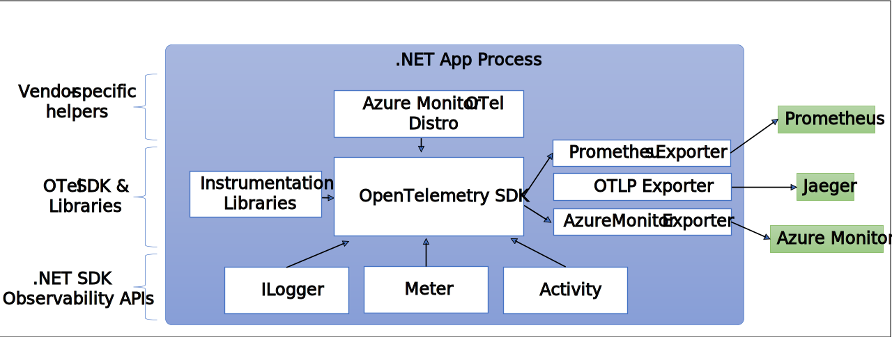

============================================================================
# Observability
* -> is the ability to understand the internal state of a system by examining its outputs
* -> **in the context of software**, this means being able to understand the internal state of a system by examining its telemetry data, which includes traces, metrics, and logs
* -> **in the context of a distributed system**, Observability is the ability to **`monitor and analyze telemetry about the state of each component`**, to be able to **`observe changes in performance`**, and to **`diagnose why those changes occur`**

* _unlike debugging, which is invasive and can affect the operation of the application, observability is intended to be transparent to the primary operation and have a small enough performance impact that it can be used continuously_

## 3 pillars of observability
* _Observability is commonly done using a combination of:_
* -> **`Logs`** - which record individual operations, such as an incoming request, a failure in a specific component, or an order being placed.
* -> **`Metrics`** - which are **measuring counters and gauges** such as number of completed requests, active requests, widgets that have been sold; or a histogram of the request latency.
* -> **`Distributed tracing`** - which **tracks requests and activities across components in a distributed system** so that we can see where time is spent and track down specific failures

* _each pillar might include telemetry data from:_
* -> **`.NET runtime`** (such as the garbage collector or JIT compiler), 
* -> **`Libraries`** (such as from Kestrel (the ASP.NET web server) and HttpClient), 
* -> **`Application-specific telemetry`** that's emitted by our code

## Why 'Observability' and 'OpenTelemetry'
* -> with **`the rise of cloud computing, microservices architectures, and increasingly complex business requirements`**, the need for **software and infrastructure observability** is greater than ever

* -> **OpenTelemetry** satisfies the need for **`observability`** while following two key principles: "You own the data that you generate. There’s no vendor lock-in", "You only have to learn a single set of APIs and conventions"

## achieve 'Observability' approaches in .NET application
* -> if we **`have access to the source code and can rebuild the app`**, then referencing and using a library such as **`OpenTelemetry`** and **explicitly in code** is the most powerful and configurable mechanism

* -> Out-of-process using **EventPipe** - tools such as **`dotnet-monitor`** can listen to logs and metrics and then process them **`without affecting any code`**

* -> using **a startup hook**, **`assemblies can be injected into the process`** that can then collect instrumentation - an example of this approach is **`OpenTelemetry .NET Automatic Instrumentation`**  

============================================================================
# NET implementation of OpenTelemetry
* -> the .NET OpenTelemetry implementation is a little different from other platforms
* -> as **.NET provides logging, metrics, and activity APIs in the framework**; that means **`OTel doesn't need to provide APIs for library authors to use`**

* =>  _the **.NET OTel implementation** uses these platform APIs (packages của .NET thay vì đặc trưng cho OTel) for instrumentation:_
* -> **`Microsoft.Extensions.Logging.ILogger<TCategoryName>`** for **logging**
* -> **`System.Diagnostics.Metrics.Meter`** for **metrics**
* -> **`System.Diagnostics.ActivitySource`** and **`System.Diagnostics.Activity`** for **distributed tracing**

## Mechanism
* -> where **OTel** comes into play is that it **`collects telemetry from those APIs and other sources (via instrumentation libraries)`** and then **`exports them to an application performance monitoring (APM) system`** for **storage and analysis**

* => the benefit that OTel brings as an industry standard is **`a common mechanism for collection, common schemas and semantics for telemetry data`**, and **`an API for how APMs can integrate with OTel`**
* -> using OTel means that **applications don't need to use APM-specific APIs or data structures**; they work against the OTel standard
* -> **APMs can either implement an APM specific exporter component or use OTLP**, which is a new wire standard for exporting telemetry data to the APM systems

## 'OpenTelemetry' packages
* _OpenTelemetry in .NET is implemented as **a series of NuGet packages** that form **a couple of categories**_

* **Core API**
* -> **`OpenTelemetry`** - main library that provides the core OTEL functionality

* **Instrumentation** -  these packages collect instrumentation from the runtime and common libraries
* -> **OpenTelemetry.Instrumentation.AspNetCore** - instrumentation for **`ASP.NET Core`** and **`Kestrel`**
* -> **OpenTelemetry.Instrumentation.GrpcNetClient** - instrumentation for **`gRPC Client`** for tracking outbound gRPC calls
* -> **OpenTelemetry.Instrumentation.Http	Instrumentation** - for **`HttpClient`** and **`HttpWebRequest`** to track outbound HTTP calls
* -> **OpenTelemetry.Instrumentation.SqlClient** - instrumentation for **`SqlClient`** used to trace database operations

* **Exporters** - these interface with APM systems such as Prometheus, Jaeger, and OTLP
* -> **OpenTelemetry.Exporter.Console** - Exporter for the **`console`**, commonly used to diagnose what telemetry is being exported
* -> **OpenTelemetry.Exporter.OpenTelemetryProtocol** - Exporter using the **`OTLP protocol`**
* -> **OpenTelemetry.Exporter.Prometheus.AspNetCore** - Exporter for **`Prometheus implemented using an ASP.NET Core endpoint`**
* -> **OpenTelemetry.Exporter.Zipkin** - Exporter for **`Zipkin`** tracing

## Architect
* 

## Example: .NET with OpenTelemetry
* https://learn.microsoft.com/en-us/dotnet/core/diagnostics/observability-otlp-example
* https://learn.microsoft.com/en-us/dotnet/core/diagnostics/observability-applicationinsights
* https://learn.microsoft.com/en-us/dotnet/core/diagnostics/observability-prgrja-example